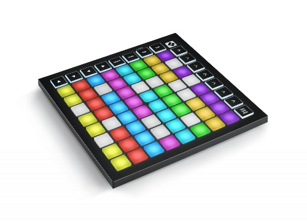

LP4K - A Launchpad API for Kotlin
====


[](https://sonarcloud.io/dashboard?id=vrudas_lp4k)
[](https://sonarcloud.io/dashboard?id=vrudas_lp4k)
[](https://sonarcloud.io/dashboard?id=vrudas_lp4k)
[](https://codecov.io/gh/vrudas/lp4k)

Launchpad is a midi device built by Novation, used to drive computer-assisted music creation applications such as Ableton Live.

The device is a square board with a 8x8 pads grid, surrounded by round command buttons. Pads and buttons can be lit in various tints of yellow, red and green.
This makes the Launchpad an interesting general-purpose I/O device, where a user can press pads and buttons to send commands to an application, and provide feedback with its 8x8 matrix of colored leds.



LP4K is a lightweight Java API (initially based on sources of LP4J project on https://github.com/OlivierCroisier/LP4J) allowing any Java application to interact with a Launchpad Mini MK3.
It also provides a embedded, web-based emulator to allow developers to design and test applications should they not have access to a physical device.

The API is split in 3 submodules :
- lp4k-api : an abstract, high-level API defining how to interact with a Launchpad (LaunchpadClient / LaunchpadListener)
- lp4k-midi : a MIDI implementation of the API, suitable to interact with a physical device.
- lp4k-emulator : a web-based emulator, using SVG and websockets.

How to use LP4K
====

From a developper's perspective, all interaction with LP4K are done through the high-level API.

First, you need to get a reference to a Launchpad :

```kotlin
    // Physical device (with auto-detected ports configuration)
    val launchpad: Launchpad = MidiLaunchpad(MidiDeviceConfiguration.autodetect())

    // Or start the emulator on http://localhost:9000
    val launchpad: Launchpad = EmulatorLaunchpad(9000)
```

From this Launchpad instance, you can :
- retrieve a LaunchpadClient, used to send commands TO the device or emulator (mostly to turn on/off the pads or buttons lights),
- set up a LaunchpadListener to react to events.

```kotlin
    val client: LaunchpadClient = launchpad.getClient()
    launchpad.setListener(ListenerExample())
```

A very simple debugging listener can look like this :

```kotlin
    class ListenerExample : LaunchpadListenerAdapter() {
        override fun onPadPressed(pad: Pad, timestamp: Long) {
            println("Pad pressed : $pad")
        }
    }
```

A more complex example
====

Listeners can be more complex.
For example, the following Listener sends commands back to the Launchpad to put a yellow light under pads when they are pressed, lighting them off when they are released.

Please also note the use of a CountDownLatch to wait for the user to press the "STOP" button before exiting the application.

```kotlin
import io.lp4k.launchpad.api.*
import io.lp4k.launchpad.midi.MidiDeviceConfiguration
import io.lp4k.launchpad.s.api.ButtonLaunchS
import io.lp4k.launchpad.s.api.ColorLaunchS
import java.util.concurrent.CountDownLatch


private val stop = CountDownLatch(1)

fun main() {
    val launchpad = MidiLaunchpad(MidiDeviceConfiguration.autodetect())
    val client = launchpad.client

    val listener = ListenerExample(client)
    launchpad.setListener(listener)

    // Set a red light under the STOP button
    client.reset()
    client.setButtonLight(Button.STOP, Color.RED, BackBufferOperation.NONE)

    stop.await()
    client.reset()
    launchpad.close()
}

class ListenerExample(private val client: LaunchpadClient) : LaunchpadListenerAdapter() {

    override fun onPadPressed(pad: Pad, timestamp: Long) {
        client.setPadLight(pad, Color.YELLOW, BackBufferOperation.NONE)
    }

    override fun onPadReleased(pad: Pad, timestamp: Long) {
        client.setPadLight(pad, Color.BLACK, BackBufferOperation.NONE)
    }

    override fun onButtonReleased(button: Button, timestamp: Long) {
        client.setButtonLight(button, Color.BLACK, BackBufferOperation.NONE)

        when (button) {
            Button.STOP -> stop.countDown()
            else -> client.setButtonLight(button, Color.BLACK, BackBufferOperation.NONE)
        }
    }

    override fun onButtonPressed(button: Button, timestamp: Long) {
        client.setButtonLight(button, Color.GREEN, BackBufferOperation.NONE)
    }

}
```
